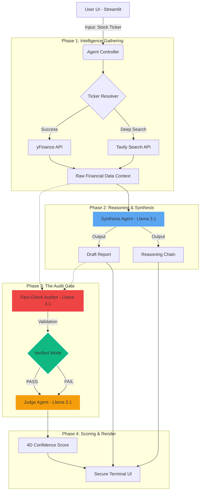

# Finsighter: Institutional-Grade Agentic Terminal

## 1. Problem Statement
Retail investors often face a "Black Box" when using AI for financial research—outputs are frequently unverified and prone to hallucinations. **Finsighter** solves this by providing an **Agentic Research Terminal** that enforces a strict **Glass-Box policy**. It ensures every financial claim is cross-referenced against raw data providers (yFinance/Tavily), providing institutional-grade transparency for high-stakes decision making.

---

## 2. Task Decomposition & Specs
The agent's workflow is decomposed into five discrete, verifiable tasks:
- **Task A (Symbol Resolution)**: Inputting a company name and resolving it to a tradable ticker using fuzzy search and search tool fallbacks.
- **Task B (Context Extraction)**: Fetching real-time market data, technicals, and news headlines into a dense JSON context.
- **Task C (Synthesis)**: Reasoning through the data using **Llama 3.1 8B** to produce a BUY/HOLD/SELL verdict with an explicit `<audit_trace>`.
- **Task D (Compliance Audit)**: A secondary agent fact-checks the synthesis against the raw context to ensure 100% numerical accuracy.
- **Task E (Evaluation)**: An **LLM-as-Judge** assigns a 4D confidence score based on a strict financial rubric.

---

## 3. Architecture Diagram

---

## 4. Implementation Details
- **API Connection**: Integrated with **Groq LPU** for high-speed inference.
- **Tool Integration**: **Tavily Search** is invoked as a primary tool for real-time news retrieval.
- **LLM-as-Judge**: Implemented a 4-tier rubric (Accuracy, Completeness, Clarity, Confidence).
- **Deployment**: Live on **Streamlit Cloud** at: [https://5cbcy7wd.streamlit.app/](https://5cbcy7wd.streamlit.app/)

---

## 5. Loom Video (3 Minutes)
[Click here to watch the project walkthrough](PASTE_YOUR_LOOM_LINK_HERE)

---

## 6. Tech Stack
- **AI Models**: Llama 3.1 (8B Instant) via Groq
- **Framework**: Streamlit (Python)
- **Data**: yFinance, Tavily AI, Supabase

