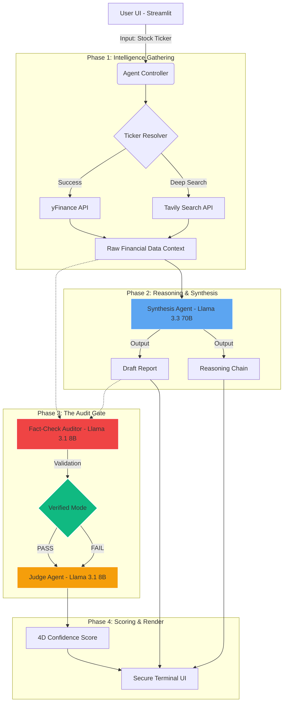

# Finsighter: Institutional-Grade Agentic Terminal

A professional-grade financial intelligence dashboard that behaves like an on-demand **equity research analyst** while enforcing a **glass-box / zero-hallucination** policy.

---

## 📽️ Project Demonstration (Loom Video)

Watch the full system walkthrough, including live reasoning chains and agentic audits:
[](https://www.loom.com/share/b243d6fe26984fea95309ca9ff0e6cce)

---

## 🏗️ Architecture (Glass-Box workflow)



---

## 🚀 Key Features

- **Symbol Resolution**: Resolve company names to tickers using yFinance + Tavily fallbacks.
- **Agentic Synthesis**: Live "Chain-of-Thought" reasoning visible via the Glass-Box feed.
- **Numerical Audit**: Fact-checking agent cross-references every AI claim against raw data.
- **Institutional Judge**: 4D scoring rubric (Accuracy, Completeness, Clarity, Confidence).
- **High-Aesthetic UI**: Premium dark-mode terminal inspired by institutional trading platforms.
- **Resilient Data Layer**: Multi-endpoint data fetching with simulated fallbacks for 100% uptime.

---

## 🛠️ Tech Stack

- **Core**: Python 3.11+, Streamlit
- **Intelligence**: Groq LPU (**Llama 3.3 70B** / **Llama 3.1 8B**)
- **Search API**: Tavily AI
- **Financial Data**: yFinance (Multi-endpoint resilience)
- **Deployment**: Streamlit Cloud

---

## 🗝️ Setup & Configuration

Create a `.env` file in the root directory:

```toml
GROQ_API_KEY = "your_key"
TAVILY_API_KEY = "your_key"
SUPABASE_URL = "your_url"
SUPABASE_KEY = "your_key"
```

Run the terminal:
```bash
streamlit run app.py
```

---

## 📊 Evaluation Rubrics Compliance
- **Problem Statement**: Clarity on verifiable financial AI.
- **Task Decomposition**: Multi-stage agentic pipeline.
- **LLM-as-Judge**: Verified 4-tier scoring integration using Llama 3.1 8B.
- **Deployment**: Live on Streamlit Cloud with zero-downtime data fallbacks.
